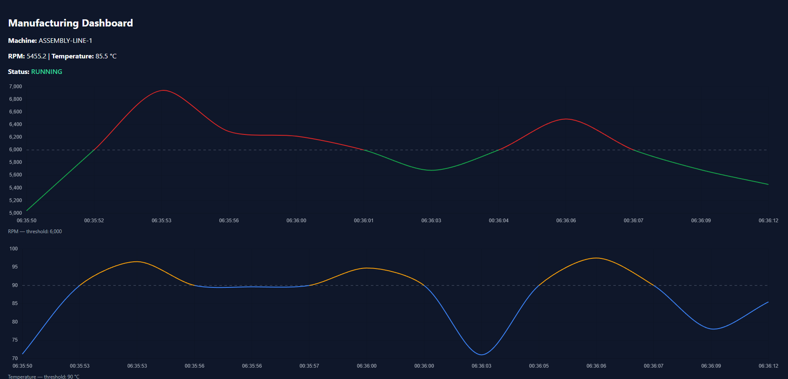
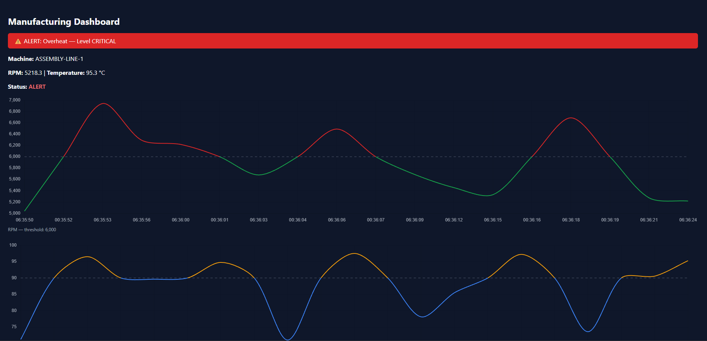
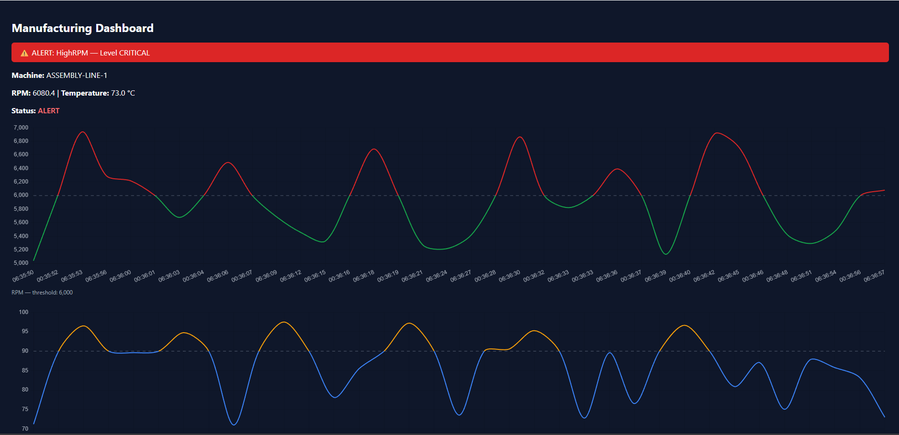
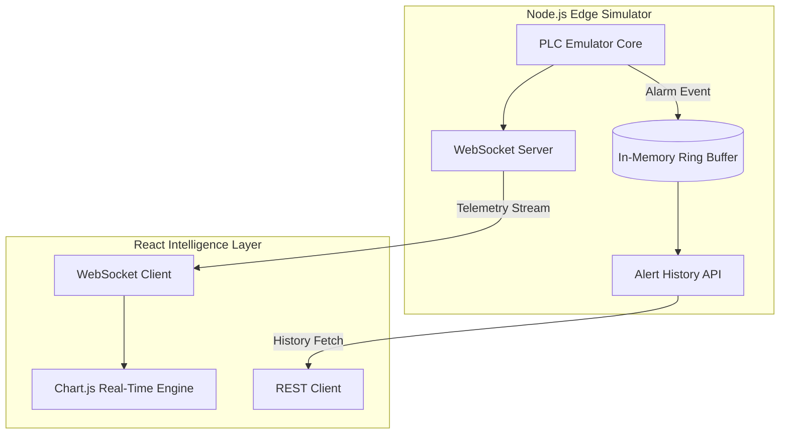

# Industrial Telemetry Dashboard

[](https://github.com/Francisco-cor/manufacturing-dashboard/actions/workflows/ci.yml)
[](https://opensource.org/licenses/MIT)
[](https://react.dev/)
[](https://nodejs.org/)
[](https://www.docker.com/)

A real-time manufacturing monitoring system designed for high-availability machine telemetry. This project implements a full-stack architecture to simulate, ingest, and visualize critical sensor data from industrial equipment.

## Technical Overview

The system is architected as an event-driven simulation where a **PLC Simulator (Node.js)** generates high-frequency telemetry data via WebSockets, and a **Reactive Dashboard (React + TypeScript)** provides real-time visualization with millisecond precision.

## Tech Stack

- **Frontend:** React, Vite, TypeScript, Chart.js
- **Backend:** Node.js, Express, `ws` (WebSocket)
- **Deployment:** Docker, Docker Compose, Nginx

### Visual State Reference

| Operational Mode | Dashboard Preview |
| :--- | :--- |
| **Normal Operation** |  |
| **Critical Temperature (>90°C)** |  |
| **Critical RPM (>6000)** |  |

---

## System Architecture

The project follows a decoupled microservices-lite pattern, ensuring that the simulator logic remains independent of the presentation layer.



---

## Getting Started

### Local Development

#### 1. Backend Setup
```bash
cd backend
npm install
npm run dev
```

#### 2. Frontend Setup
```bash
cd frontend
npm install
npm run dev
```

### Docker Deployment (Full Stack)

Ensure you have Docker and Docker Compose installed.

```bash
docker compose up --build
```

**Services:**
- **Frontend (nginx):** [http://localhost:8080](http://localhost:8080)
- **Backend (Node.js):** [http://localhost:4000](http://localhost:4000)

---

## Configuration

The backend reads configuration from a `.env` file (use `.env.example` as a template):

| Variable | Description | Default |
| :--- | :--- | :--- |
| `PORT` | HTTP/WS server port | `4000` |
| `TICK_MS` | Simulator emission interval (ms) | `3000` |
| `ALERT_RPM` | RPM alert threshold | `6000` |
| `ALERT_TEMP` | Temperature alert threshold (°C) | `90` |
| `ALARM_BUFFER` | Max alerts in memory | `100` |
| `CORS_ORIGINS` | Allowed CORS origins (comma-separated) | `*` |

---

## API & Healthchecks

### Healthcheck Validation
Used by Docker for `service_healthy` status.

```bash
curl http://localhost:4000/health
# → { "status": "ok", "uptime": 42, "timestamp": "2025-11-10T00:00:00.000Z" }
```

### Alert History
Fetch recent alerts from the in-memory ring buffer.
`GET /api/alarms`

---

## Folder Structure

```
manufacturing-dashboard/
├─ backend/             # Node.js PLC Simulator
│  ├─ src/              # Logic & Routes
│  ├─ Dockerfile
│  └─ .env.example
├─ frontend/            # React + TypeScript Dashboard
│  ├─ src/              # Components & Visualizations
│  └─ Dockerfile
├─ docs/                # Project Documentation & Assets
│  └─ screenshots/      # Visual references
├─ docker-compose.yml   # Orchestration
└─ README.md            # You are here
```

---

## License

This project is licensed under the MIT License - see the [LICENSE](LICENSE) file for details.
