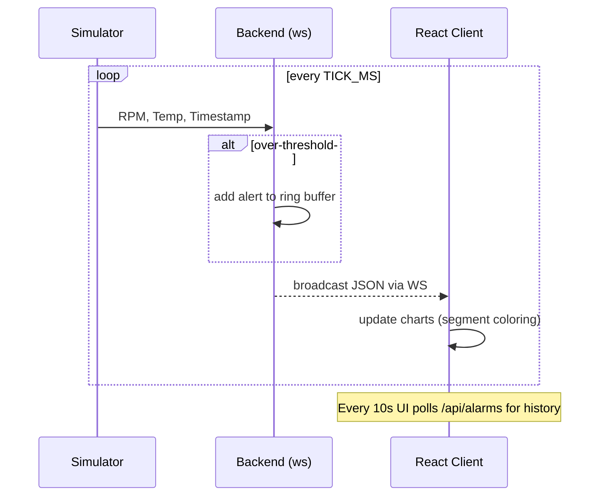

# Architecture — Detailed

## Component Diagram
```mermaid
flowchart LR
  subgraph Browser[React App (Vite/NGINX)]
    UI[Dashboard UI]\nChart.js + RT Table
    Poll[Alarm Poller]\n(fetch /api/alarms)
  end

  subgraph App[Backend (Express + ws)]
    Sim[PLC Simulator]\n(rand RPM, Temp)
    WS[WebSocket Server]\n(broadcast JSON)
    Logic[Alert Logic]\n(over-threshold)
    Buf[(Alarm Ring Buffer)]
    API[/GET /api/alarms/]
    Health[/GET /health/]
  end

  UI <-- WebSocket --> WS
  Poll --> API
  Sim --> Logic --> WS
  Logic --> Buf
  Health -. Docker Healthcheck .- NGINX

  classDef svc fill:#0ea5e9,stroke:#0369a1,color:#fff;
  classDef buf fill:#22c55e,stroke:#14532d,color:#fff;
  class UI,Poll svc
  class Sim,WS,Logic,API,Health svc
  class Buf buf
```

## Sequence (Real-time Path)


## Data Shape (WebSocket Payload)
```json
{
  "machineId": "ASSEMBLY-LINE-1",
  "timestamp": "2025-11-10T00:00:00.000Z",
  "rpm": 6123.4,
  "temperature": 93.2,
  "status": "ALERT",
  "alert": { "type": "Overheat" , "level": "CRITICAL" }
}
```
